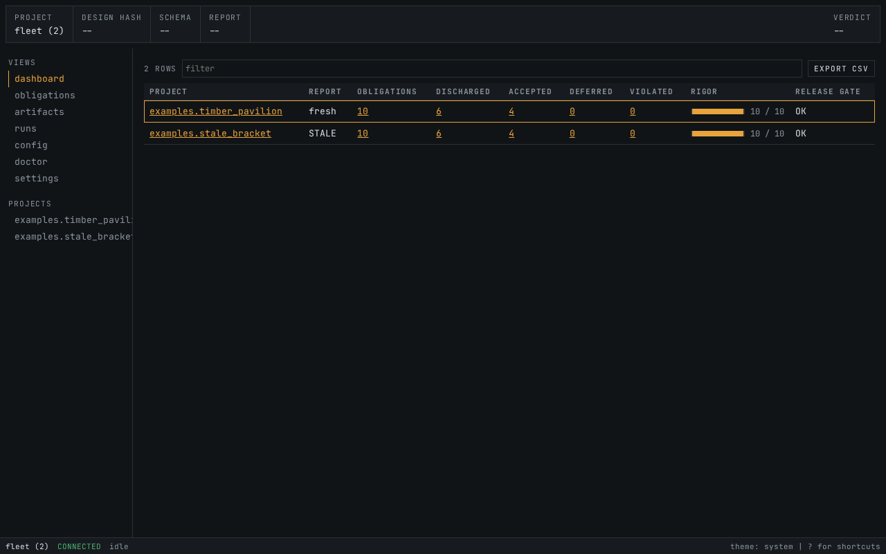
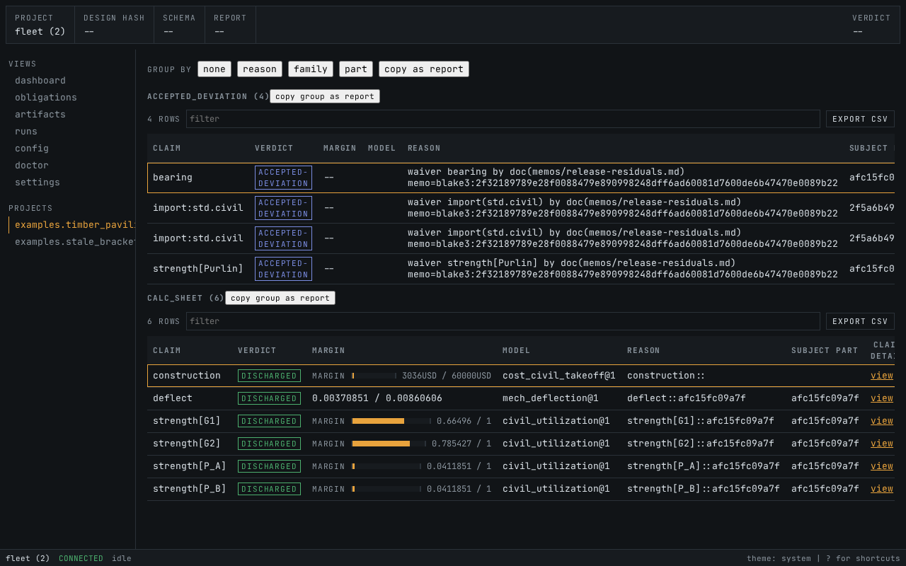
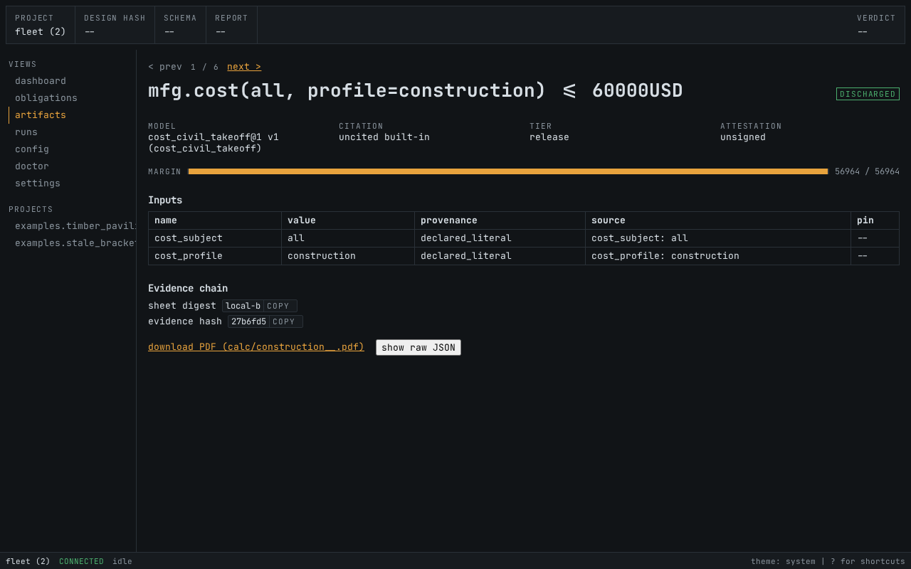
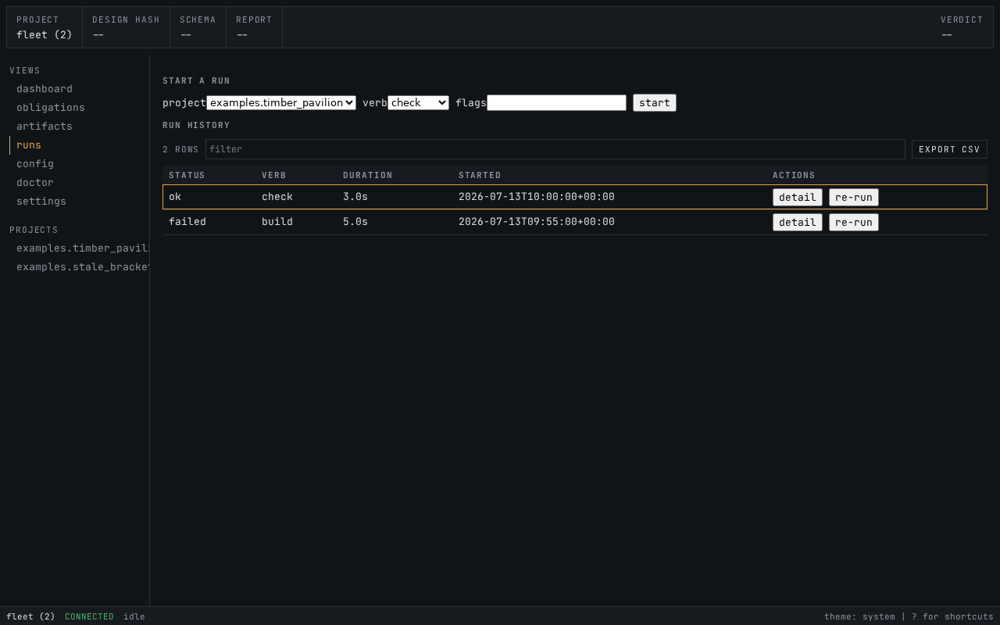

# graphite

graphite (the drawing mineral) is the interaction surface for the
regolith engineering toolchain (the lithos project, checked out as a
sibling `../lithos` for development): a localhost-only web app and a
terminal UI over one shared service layer, for reading what a fleet
of regolith projects proved and for driving builds. It renders what
the pipeline emitted -- verdicts, margins, calc sheets, drawings,
BOMs, run logs -- and never recomputes any of it (the honesty rule,
charter sec. 3.2).



## Install

graphite ships as a single Python wheel with the web frontend bundled
inside -- Node is a development-only dependency, never needed at
runtime.

```
pip install <path-to>/graphite-0.2.0-py3-none-any.whl
```

Requires Python >= 3.12 and the `regolith` wheel (graphite declares
it as a dependency; install its wheel alongside).

For development from a checkout:

```
make install            # uv sync, editable regolith path dep on ../lithos
make frontend-install   # npm install (dev-only)
make check              # the full gate
make build              # frontend bundle + wheel (dist/graphite-*.whl)
```

## Quickstart

```
graphite serve <fleet-root>     # web app on http://127.0.0.1:8765
graphite tui <project-root>     # the same surfaces in a terminal
```

`<fleet-root>` is any directory containing one or more regolith
projects (a `magnetite.toml` marks each). `graphite serve` refuses to
bind anything but localhost by design, and the served page makes zero
external requests -- fonts, scripts, and 3D assets are all bundled.

Open the dashboard and every census count deep-links into its
filtered drill-down:



Each obligation opens down to its calc sheet -- claim, model, inputs
with provenance, margin, and the evidence hash chain, with the PDF
one click away:



Builds are driven from the run console (live phase progress, cancel,
verdict diff, durable history):



Keyboard-first everywhere: `?` opens the shortcut sheet, `ctrl+k` the
command palette, `j`/`k` walk any table -- identically in the web app
and the TUI.

## Documentation

- [User guide](docs/guide.md) -- reading the dashboard, driving runs,
  the calc book walk.
- [CONTRIBUTING](CONTRIBUTING.md) -- workflow law for changes.
- `docs/spec/01..04` -- the product charter, architecture, design
  system, and feature doctrine (normative).

## Layout

```
graphite/service/   the ONE regolith boundary (discovery, reports, runs)
graphite/server/    FastAPI app over the service layer (+ bundled frontend)
graphite/tui/       textual TUI, the second renderer over the same body
frontend/           React app (dev-only; `make build` bundles it into the wheel)
tests/              pytest (service/API/TUI) + the committed fixture project
```

The screenshots above regenerate with `make screenshots` (real
Playwright captures of the app over the committed fixture, never
mockups).
